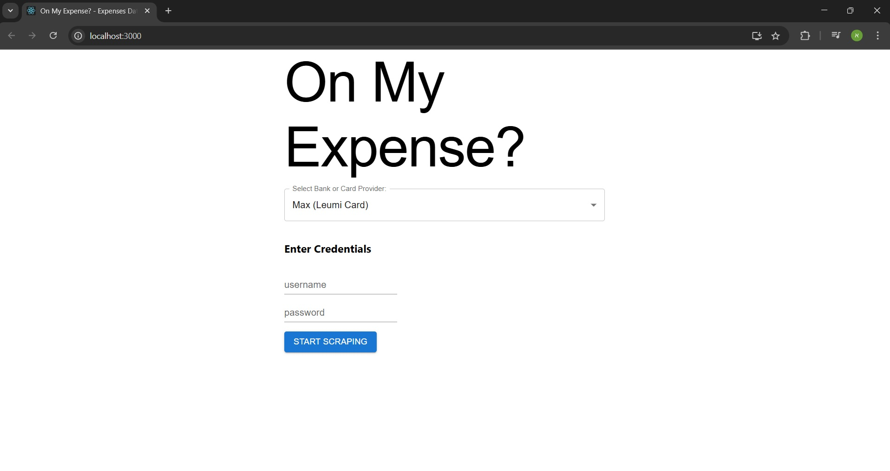
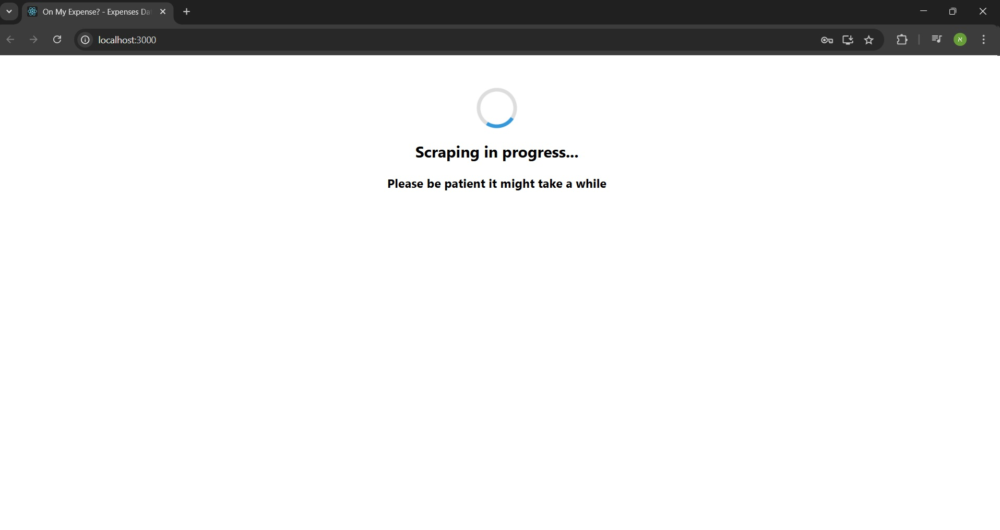
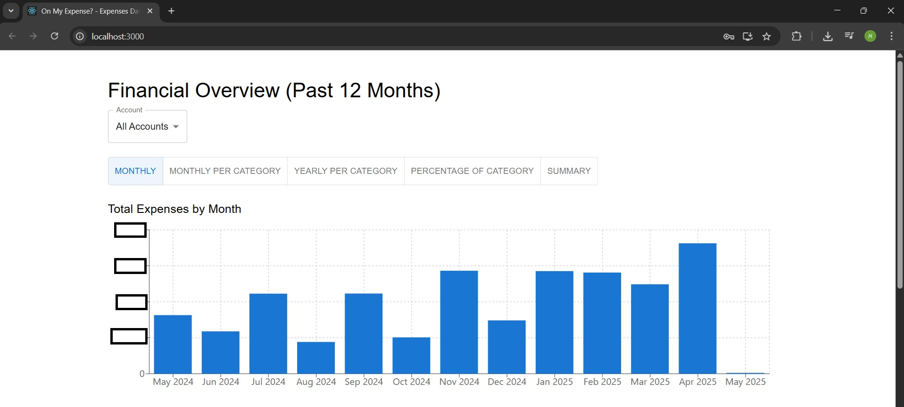
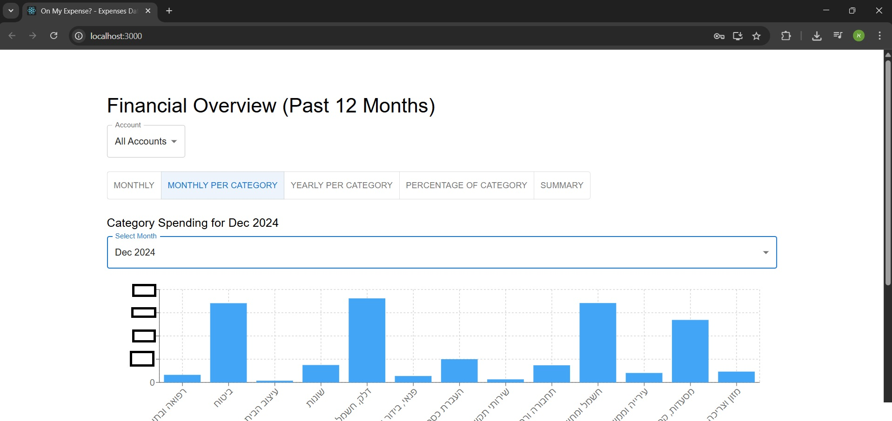
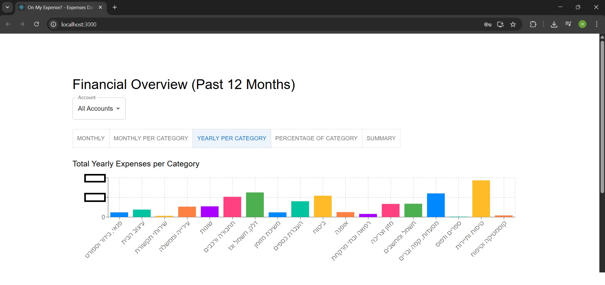
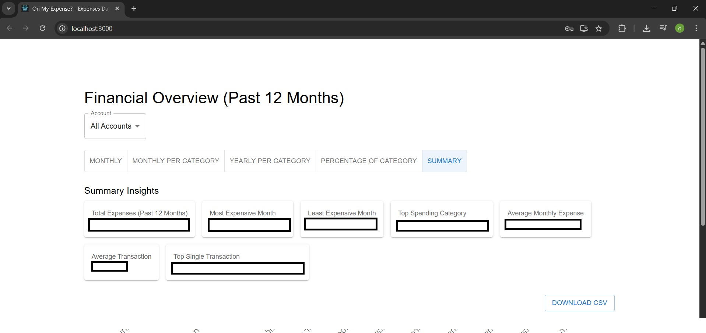
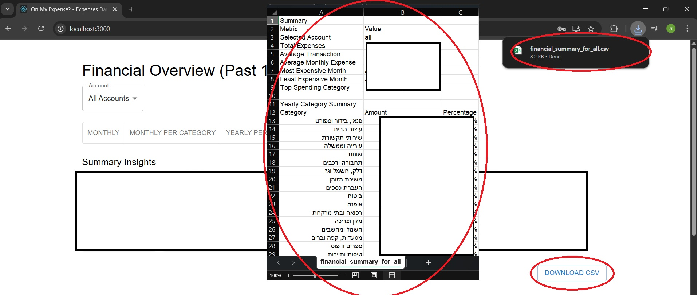

# 💸 On My Expense?

A full-stack financial dashboard application built with **React** (frontend) and **Node.js/Express** (backend). This project leverages the [`israeli-bank-scrapers`](https://github.com/eshaham/israeli-bank-scrapers) library to securely retrieve your Israeli bank and credit card transaction history and visualize it with rich BI-style charts and insights.

> This project only processes **transactions from the last 12 months**.

---

## 🚀 Features

### 🔍 Scraping & Data Handling
- Connects to your chosen bank using credentials (client-side only)
- Supports multiple banks and credit card providers in Israel
- Extracts up to 12 months of transaction data

### 📊 Data Visualization
- **Total Monthly Expenses**
- **Yearly Category Breakdown** 
- **Monthly Category Spending** 
- **Category Percentage Pie Chart**
- **Summary Tab** with smart insights:
  - Total expenses
  - Most/least expensive months
  - Average monthly/transactional spend
  - Top spending category
  - Highest transaction

### ⚙️ Filters & Interaction
- Toggle between charts
- Filter by **account**
- Download financial summary as **CSV**

---

## 🧑‍💻 Tech Stack

| Layer       | Tech                                                                 |
|-------------|----------------------------------------------------------------------|
| Frontend    | React, Material UI, Recharts                                         |
| Backend     | Node.js, Express                                                     |
| Data Source | [`israeli-bank-scrapers`](https://github.com/eshaham/israeli-bank-scrapers) |
| Data Format | JSON                                                                 |
| Export      | CSV (UTF-8 BOM for Hebrew support)                                   |

---

## 🧪 Live Demo & Repositories

| Part       | Repository |
|------------|------------|
| Frontend   | [expenses-scraper](https://github.com/AlexeyTev/expenses-scraper) |
| Backend    | [expenses-server](https://github.com/AlexeyTev/expenses-server) |

---
---

## 🖼️ App Screenshots

### 🔐 Login Page  


### 🔄 Loading Screen  


### 📊 Monthly Expenses Overview  


### 📊 Monthly Expenses by Category  


### 📅 Yearly Expenses by Category  


### 📋 Summary Dashboard  


### 📥 Downloadable CSV Output  


---
## 📦 Installation Instructions

### 1. Clone Both Repositories

```bash
git clone https://github.com/AlexeyTev/expenses-scraper.git
git clone https://github.com/AlexeyTev/expenses-server.git

### 2. Install Dependencies

### Frontend
```bash
cd expenses-scraper
npm install

### Backend
```bash
cd ../expenses-server
npm install

### Run
cd expenses-server
npm start
cd ../expenses-scraper
npm start
